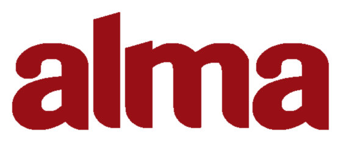

Alma
====

Alma is a statically-typed, stack-based, functional programming language
heavily inspired by Forth, Standard ML, and the language [Cat][cat] created
by Christopher Diggins.

  [cat]: https://www.codeproject.com/articles/16247/cat-a-statically-typed-programming-language-interp
  
As of right now I'm pretty heavily rewriting all of it, so there's not
too much to show. The old version right now lives in the `old/` folder
but will be cleaned up at some point in the future.
